# Lambda表达式


## 为什么要有lambda

1. 需要给方法传递一段代码作为参数

2. 在C和C++中可以使用指针，一两个*号&号能解决的问题。 但是在Java中并没有指针这个东东。

3. 而且Java的函数接收的参数都是对象（这个时候可以认为基本类型也是对象），可从来没听说过有函数对象这个说法啊。


例如:

需要实现根据传入的方法不同，有不同的打印格式。

```Java
static void executeFunc(方法？？,String word) {
    // todo 用传入的方法打印word变量
}
```


### 匿名内部类写法

直接传函数不行是吧，那我就用一个接口包裹住这个方法，传接口对象进去就可以啦！

```Java
package main;

interface Wrapper {
    void myPrint(String w);
}

class Solution {
	//
    static void executeFunc(Wrapper w, String word) {
        w.myPrint(word);
    }


}

```


调用

```Java
public static void main(String[] args) {
        executeFunc(new Wrapper() {
            @Override
            public void myPrint(String w) {
                // 个性化拓展，例如在打印之前记录时间什么的
                System.out.println(w);
            }
        }, "Hello Lambda!");
    }

```

### Lambda写法

```Java
public static void main(String[] args) {
    executeFunc(w -> {
        // 个性化拓展，例如在打印之前记录时间什么的
        System.out.println(w);
    }, "Hello Lambda!");
}

```


### 两种写法比较

```Java
public class innerClassTest {
    public static void main(String[] args) {
        //将抽象类Wrapper中的方法在大括号中实现了
        //这样便可以省略一个类的书写
        //并且，匿名内部类还能用于接口上
        Solution.executeFunc(new Wrapper() {
            @Override
            public void myPrint(String w) {
                System.out.println("内部类打印:" + w);
            }
        }, "TestInnerClass");

        // lambda写法
        Solution.executeFunc(w -> {
            // 个性化拓展，例如在打印之前记录时间什么的
            System.out.println(w);
        }, "TestLambda");
    }
}
```


#### 匿名内部类原理


利用IDEA的ShowByteCode功能进行查看。字节码（ByteCode）是JVM运行时读取执行的，一切的语法特性，都会在这里暴露无遗


JVM里是不管你内部内部类的，它只认类和类实例化的对象。

**接口是不能实例化的，也就是说，是不能通过直接new的方式新建一个纯接口对象，而是要编写一个类来实现接口，进而实例化这个类。**

匿名内部类通过编译器新建了一个类，叫`Solution$1` , `在Solution$1内部实现了抽象方法`


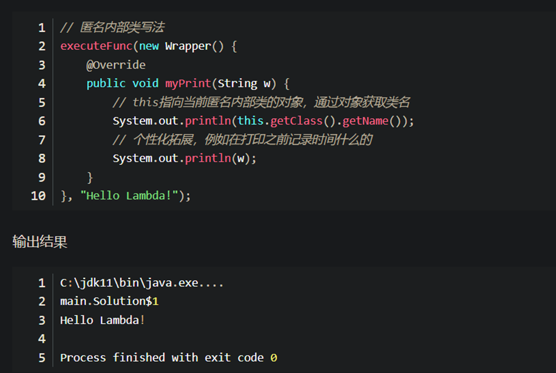


#### Lambda原理

1. 在类编译时，**`会生成一个私有的 静态的方法+一个静态内部类；`**
2. **`在内部类中实现了函数式接口，在实现接口的方法中，会调用编译器生成的静态方法；`**
3. 在使用lambda表达式的地方，**`通过传递内部类实例，来调用函数式接口方法。`**


```Java
public class LambdaTest {
    public static void PrintString(String s, Print<String> print) {
        print.print(s);
    }

    public static void main(String[] args) {
        //创建内部类的对象
        PrintString("test", new LambdaTest$$Lambda$1());
    }

    
    //原有的接口实现 代码会在这个 私有的静态方法内部
    private static void lambda$main$0(String x) {
        System.out.println(x);
    }

    //编译时会生成一个静态内部类,实现方法(通过调用另一个静态方法)
    static final class LambdaTest$$Lambda$1 implements Print {
        public void print(Object obj) {
            LambdaTest.lambda$main$0((String) obj);
        }
        private LambdaTest$$Lambda$1() {
        }
    }

}

@FunctionalInterface
interface Print<T> {
    public void print(T x);
}
```


## Lambda表达式与匿名内部类的区别

1. 所需类型不同 

匿名内部类：可以是接口，也可以是抽象类，还可以是具体类。 

Lambda表达式：只能是接口

 

2. 抽象方法的数量不一样 

匿名内部类，中接口的抽象方法的数量是随意的。 

Lambda表达式中有且只能有一个抽象方法(函数式接口)。

 

3. 实现原理不同

匿名内部类：编译之后会产生一个单独的.class字节码文件

Lambda表达式：编译之后不会产生一个单独的.class字节码文件。对应的字节码会在运行的时候动态生成。

 

4. 调用默认方法不同

匿名内部类实现的抽象方法的方法体允许调用接口中定义的默认方法；

但 Lambda 表达式的代码块不允许调用接口中定义的默认方法。


## 什么是Lambda表达式

Lambda表达式脱胎于原来的匿名类给方法传递函数功能

**`Lambda表达式的核心思想，就是将一段函数作为参数进行传递`**

 


Java8之前: 每次为了实现不同的功能,需要写大量的代码

Java8: 我们精简代码, 只需要写核心的代码即可


```Java
// Java8 之前：  
new Thread(new Runnable() {
    @Override
    public void run() {
        System.out.println("Before Java8, too much code for too little to do");
    }
}).start();

//Java8 
new Thread( () -> System.out.println("In Java8, Lambda expression rocks !!") ).start();  
```


## 必要条件


1. **`方法的参数必须为接口才能使用Lambda`**

2. 并且作为参数的接口中**`有且仅有一个抽象方法`**（函数式接口 @FunctionalInterface）

 

函数式接口: 整个接口只有一个抽象方法需要重写


## Lambda表达式语法


Java8中引入了一个新的操作符 "->" 该操作符称为箭头操作符或 Lambda 操作符

箭头操作符将 Lambda 表达式拆分成两部分：

 

 左侧：Lambda 表达式的参数列表

 右侧：Lambda 表达式中所需执行的功能， 即 Lambda 体


1. 语法格式一：无参，无返回值，Lambda 体只需一条语句

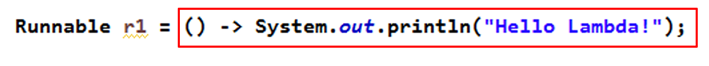


2. 语法格式二：Lambda 表达式的参数列表的数据类型可以省略不写，因为JVM编译器通过上下文推断出，数据类型，即“类型推断”

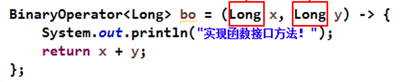

​                               

 

3. 语法格式三：Lambda 需要一个参数

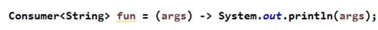


 

4. 语法格式四：Lambda 只需要一个参数时，参数的小括号可以省略

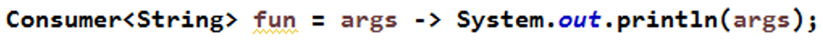


5. 语法格式五：有两个以上的参数，有返回值，并且 Lambda 体中有多条语句

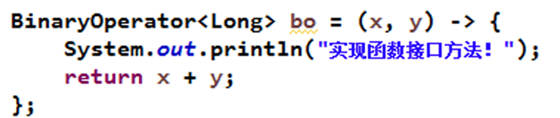


 

6. 语法格式六：若 Lambda 体中只有一条语句， return 和 大括号都可以省略不写

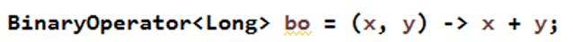


#   


# 函数式接口

## 什么是函数式接口

函数式接口：`接口中只有一个抽象方法的接口，称为函数式接口。`

可以使用注解 **@FunctionalInterface** 修饰, @FunctionalInterface 可以检查是否是函数式接口.


**Lambda表达式是必须使用函数式接口的**, 在JDK中已经为我们提供了大量的函数式接口.


## 常用的函数式接口

在JDK中帮我们提供的有函数式接口，主要是在 *java.util.function* 包中。

### Supplier 生产数据

**无参有返回值的接口**，对于的Lambda表达式需要提供一个返回数据的类型。

Supplier接口是用来生产数据的


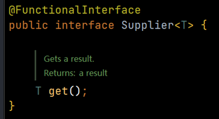


```Java
/**
 * Supplier 函数式接口的使用
 */
public class SupplierTest {
    public static void main(String[] args) {
        fun1(()->{
            int arr[] = {22,33,55,66,44,99,10};
            // 计算出数组中的最大值
            Arrays.sort(arr);
            return arr[arr.length-1];
        });
    }

    private static void fun1(Supplier<Integer> supplier){
        // get() 是一个无参的有返回值的 抽象方法
        Integer max = supplier.get();
        System.out.println("max = " + max);

    }
}
```


### Consumer 消费数据

Consumer接口是用来消费数据的，使用的时候需要指定一个泛型来定义参数类型。


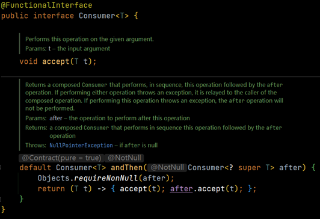


```java
public class ConsumerTest {

    public static void main(String[] args) {
        test(msg -> {
            System.out.println(msg + "-> 转换为小写：" + msg.toLowerCase());
        });
    }

    public static void test(Consumer<String> consumer){
        consumer.accept("Hello World");
    }

    public static void test2(Consumer<String> c1,Consumer<String> c2){
        String str = "Hello World";
        c1.accept(str); // 转小写
        c2.accept(str); // 转大写
    }
}
```


#### 默认方法:andThen

如果一个方法的参数和返回值全部是Consumer类型，那么就可以实现效果，消费一个数据的时候， **首先做一个操作，然后再做一个操作**，实现组合，而这个方法就是Consumer接口中的default方法 andThen方法


```Java
public class ConsumerAndThenTest {
    public static void main(String[] args) {
        test2(msg1->{
            System.out.println(msg1 + "-> 转换为小写：" + msg1.toLowerCase());
        },msg2->{
            System.out.println(msg2 + "-> 转换为大写：" + msg2.toUpperCase());
        });
    }

    public static void test2(Consumer<String> c1,Consumer<String> c2){
        String str = "Hello World";
        //c1.accept(str); // 转小写
        //c2.accept(str); // 转大写
        //c1.andThen(c2).accept(str);
        c2.andThen(c1).accept(str);
    }
}
```


### Function

Function接口是根据一个类型的数据得到另一个类型的数据 

有参有返回值的接口

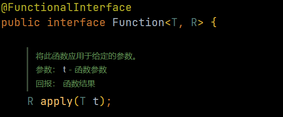

默认的compose方法的作用顺序和andThen方法刚好相反 
而静态方法identity则是，输入什么参数就返回什么参数

```Java
public class FunctionTest {

    public static void main(String[] args) {
        test(msg ->{
            return Integer.parseInt(msg);
        });
    }

    public static void test(Function<String,Integer> function){
        Integer apply = function.apply("666");
        System.out.println("apply = " + apply);
    }
}

```


### Predicate 逻辑判断

有参且返回值为Boolean的接口


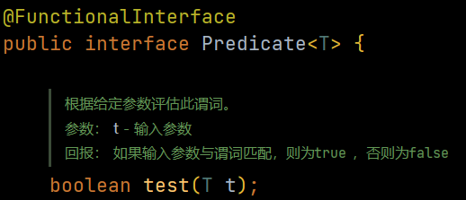

在Predicate中的默认方法提供了逻辑关系操作 and or negate isEquals方法


```Java
public class PredicateDefaultTest {

    public static void main(String[] args) {
        test(msg1 -> {
            return msg1.contains("H");
        },msg2 -> {
            return msg2.contains("W");
        });
    }

    private static void test(Predicate<String> p1,Predicate<String> p2){
        /*boolean b1 = predicate.test(msg);
        boolean b2 = predicate.test("Hello");*/
        // b1 包含H b2 包含W
        // p1 包含H 同时 p2 包含W
        boolean bb1 = p1.and(p2).test("Hello");
        // p1 包含H 或者 p2 包含W
        boolean bb2 = p1.or(p2).test("Hello");
        // p1 不包含H
        boolean bb3 = p1.negate().test("Hello");
        System.out.println(bb1); // FALSE
        System.out.println(bb2); // TRUE
        System.out.println(bb3); // FALSE
    }
}
```


#  

# 方法引用


符号表示： `::`
符号说明：**`双冒号为方法引用运算符，而它所在的表达式被称为`**
方法引用
应用场景：如果Lambda表达式所要实现的方案，已经有其他方法存在相同的方案，那么则可以使用方法引用。


小结：方法引用是对Lambda表达式符合特定情况下的一种缩写方式，它使得我们的Lambda表达式更加的精简，也可以理解为lambda表达式的缩写形式，不过要注意的是方法引用只能引用已经存在的方法。


## 常见的引用方式：

方法引用在JDK8中使用是相当灵活的，有以下几种形式：

1. instanceName::methodName   对象::方法名 

2. ClassName::staticMethodName    类名::静态方法
3. ClassName::methodName    类名::普通方法
4. ClassName::new 类名::new 调用的构造器
5. TypeName[]::new String[]::new 调用数组的构造器


### 2.1 对象名::方法名


最常见的用法.


相当于创建一个对象,然后引用方法


方法引用的注意事项：
1. **`被引用的方法，参数要和接口中的抽象方法的参数一样`**
1. **`当接口抽象方法有返回值时，被引用的方法也必须有返回值`** (例如下面的Supplier是有返回值的,所以引用的方法也必须要有返回值)


```Java
public class FunctionRefTest03 {

    public static void main(String[] args) {
        Date now = new Date();
        Supplier<Long> supplier = ()->{return now.getTime();};
        System.out.println(supplier.get());
        // 然后我们通过 方法引用 的方式来处理
        Supplier<Long> supplier1 = now::getTime;
        System.out.println(supplier1.get());
    }
}
```


### 2.2 类名::静态方法名


```Java
public class FunctionRefTest04 {

    public static void main(String[] args) {
        Supplier<Long> supplier1 = ()->{
            return System.currentTimeMillis();
        };
        System.out.println(supplier1.get());

        // 通过 静态方法引用 来实现
        Supplier<Long> supplier2 = System::currentTimeMillis;
        System.out.println(supplier2.get());
    }
}
```


### 2.3 类名::引用实例方法

  Java面向对象中，类名只能调用静态方法，类名引用实例方法是有前提的，**`实际上是拿第一个参数作为方法的调用者`**


```java
public class FunctionRefTest05 {

    public static void main(String[] args) {
        Function<String, Integer> function = (s) -> {
            return s.length();
        };
        System.out.println(function.apply("hello"));

        // 通过方法引用来实现
        Function<String, Integer> function1 = String::length;
        System.out.println(function1.apply("hahahaha"));

        BiFunction<String, Integer, String> function3 = String::substring;
        //Function<String,Integer> function2 = String::substring;

        Function<String, Integer> function2 = String::length;
        function2.apply("HelloWorld");
        //System.out.println(msg);

        System.out.println("");
    }
}

```


### 2.4 类名::构造器


由于构造器的名称和类名完全一致，所以构造器引用使用::new的格式使用


```Java
public class FunctionRefTest06 {

    public static void main(String[] args) {
        Supplier<Person> sup = ()->{return new Person();};
        System.out.println(sup.get());
        // 然后通过 方法引用来实现
        Supplier<Person> sup1 = Person::new;
        //无参
        System.out.println(sup1.get());

        BiFunction<String, Integer, Person> function = Person::new;
        //有参
        System.out.println(function.apply("张三",22));
    }
}

```


### 2.5 数组::构造器


```Java
public class FunctionRefTest07 {

    public static void main(String[] args) {
        Function<Integer,String[]> fun1 = (len)->{
            return new String[len];
        };
        String[] a1 = fun1.apply(3);
        System.out.println("数组的长度是：" + a1.length);
        // 方法引用 的方式来调用数组的构造器
        Function<Integer,String[]> fun2 = String[]::new;
        String[] a2 = fun2.apply(5);
        System.out.println("数组的长度是：" + a2.length);
    }
}

```


## 小结

小结：**`方法引用是对Lambda表达式符合特定情况下的一种缩写方式`**，它使得我们的Lambda表达式更加的精简，**`也可以理解为lambda表达式的缩写形式`**，不过要注意的是方法引用只能引用已经存在的方法。

#   

# Stream

## Steam流式思想概述

注意：**`Stream和IO流(InputStream/OutputStream)没有任何关系`**，请暂时忘记对传统IO流的固有印象！

==Stream流式思想类似于工厂车间的“生产流水线”==

Stream流不是一种数据结构，不保存数据，而是对数据进行加工处理。Stream可以看作是流水线上的一个工序。在流水线上,通过多个工序让一个原材料加工成一个商品.

Stream API能让我们快速完成许多复杂的操作，如筛选、切片、映射、查找、去除重复，统计，匹配和归约。


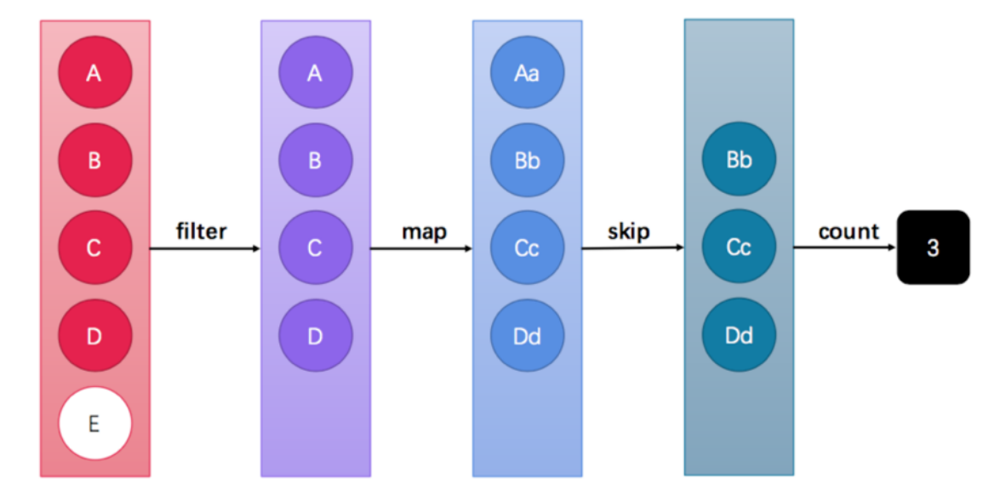


## 获取Stream流的方式


### Collection

首先，java.util.Collection 接口中加入了default方法stream，也就是说**`Collection接口下的所有的实现都可以通过steam方法来获取Stream流。`**


```java 
package src.com.bobo.jdk.stream;

import java.util.*;

public class StreamTest03 {

    public static void main(String[] args) {
        List<String> list = new ArrayList<>();
        list.stream();
        Set<String> set = new HashSet<>();
        set.stream();
        Vector vector = new Vector();
        vector.stream();
    }
}
```


### Map获取Stream

但是Map接口别没有实现Collection接口，那这时怎么办呢？这时我们可以根据Map获取对应的key value的集合。

```java
package src.com.bobo.jdk.stream;

import java.util.*;
import java.util.stream.Stream;

public class StreamTest04 {

    public static void main(String[] args) {
        Map<String, Object> map = new HashMap<>();
        Stream<String> stream = map.keySet().stream(); // key的Stream流
        Stream<Object> stream1 = map.values().stream(); // value的Stream流
        Stream<Map.Entry<String, Object>> stream2 = map.entrySet().stream(); // entry
    }
}

```

### 数组获取Stream

https://www.wanaright.com/2020/02/28/java-8-array-stream/


#### 使用Arrays.stream()方法

可以使用流`stream`来将下列3种数组快速转为`List`，分别是`int[]`、`long[]`、`double[]`，其他数据类型比如`short[]`、`byte[]`、`char[]`暂时不支持

```Java
String[] str = {"a", "b", "c"};
Arrays.stream(str).forEach(System.out::println);// 逐行打出 "a" "b" "c"

int[] number = {1, 2, 3};
Arrays.stream(number).forEach(System.out::println);// 逐行打出 1 2 3

double[] doubles = {1.1, 2.2, 3.3}; //逐行打出 1.1  2.2   3.3
Arrays.stream(doubles).forEach(System.out::println);
```


#### 使用Stream.of() 方法

这个方法就要区分数组内容是对象还是基本数据结构了，他们得到的结果是不同的：

```Java
String[] str = {"a", "b", "c"};
Stream.of(str).forEach(System.out::println);// 逐行打出 "a" "b" "c"

int[] number = {1, 2, 3};
// 这里打出的是数组指针，其实内容是只含有一个整体的[1,2,3]数组流
Stream.of(number).forEach(System.out::println);

// 当然我们可以把它继续展开成我们想要的数组流, 这样就会逐行打出 1 2 3 啦
Stream.of(number).flatMapToInt(Arrays::stream).forEach(System.out::println);
```


## Stream常用方法介绍

==终结方法：返回值类型不再是 Stream 类型的方法，不再支持链式调用==。本小节中，`终结方法包括count 和forEach 方法`。


==非终结方法：返回值类型仍然是 Stream 类型的方法，支持链式调用。==（除了终结方法外，其余方法均为非终结方法。）


Stream注意事项(重要)
1. Stream只能操作一次
2. Stream方法返回的是新的流
3. **`Stream不调用终结方法，中间的操作不会执行`**


### forEach  遍历  (终结方法)

 forEach用来遍历流中的数据的

```java
void forEach(Consumer<? super T> action);
```


该方法接受一个Consumer接口，会将每一个流元素交给函数处理

```java
public static void main(String[] args) {
    Stream.of("a1", "a2", "a3").forEach(System.out::println);; 
 }
```


### count 统计个数 (终结方法)


Stream流中的count方法用来统计其中的元素个数的

```Java
long count();
```


该方法返回一个long值，代表元素的个数。

```java
public class StreamTest08Count {

    public static void main(String[] args) {
        long count = Stream.of("a1", "a2", "a3").count();
        System.out.println(count);
    }
}
```

结果: 3


### filter 过滤筛选

可以通过filter方法将一个流转换成另一个子集流(从字面理解,就是过滤筛选)


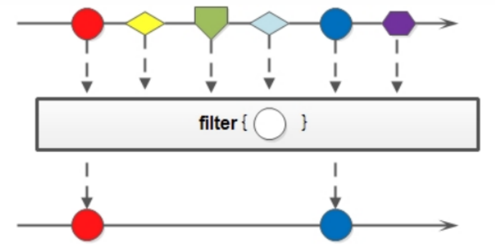


```java
Stream<T> filter(Predicate<? super T> predicate);
```


调用:

```java
public class StreamTest08Filter {
    public static void main(String[] args) {
        Stream.of("a1", "a2", "a3", "bb", "cc", "aa", "dd")
                .filter((s) -> s.contains("a"))
                .forEach(System.out::println); //过滤出所有包含a的字符串
    }
}
```


### limit 支取前n个数据

**`limit方法可以对流进行截取处理，支取前n个数据`**


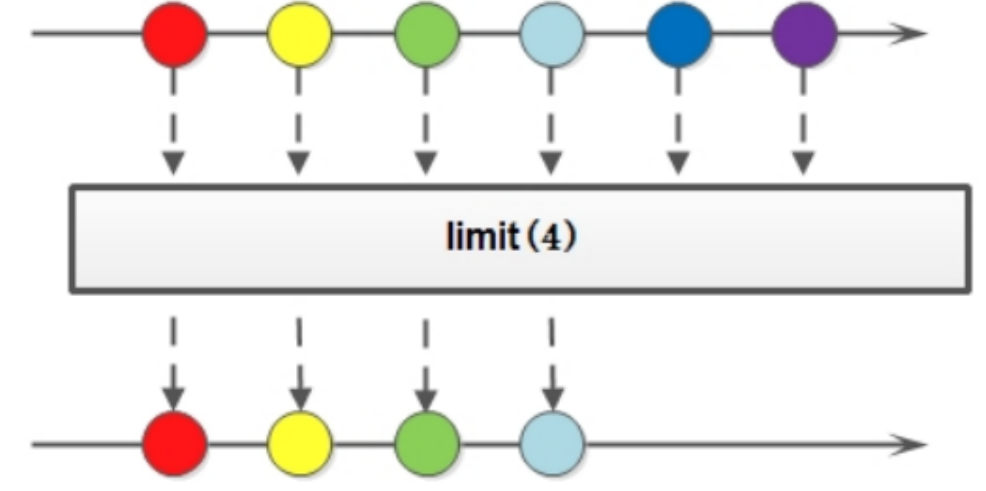


```Java
Stream<T> limit(long maxSize);
```


参数是一个long类型的数值，如果集合当前长度大于参数就进行截取，否则不操作：

```Java
public static void main(String[] args) {
    Stream.of("a1", "a2", "a3","bb","cc","aa","dd") 
        .limit(3)
        .forEach(System.out::println); 
 }
```

打印结果:

a1
a2
a3


### skip 跳过前面几个元素

如果希望跳过前面几个元素，可以使用skip方法获取一个截取之后的新流：


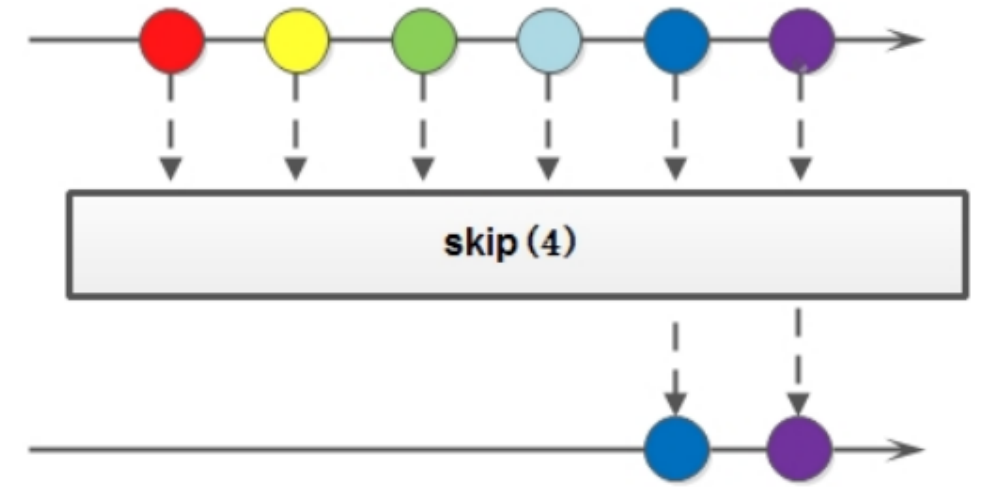


```java
public static void main(String[] args) {
    Stream.of("a1", "a2", "a3","bb","cc","aa","dd") 
        .skip(3)
        .forEach(System.out::println); 
 }
```

输出:

bb
cc
aa
dd


### map 映射

将流中的元素映射到另一个流中，可以使用map方法：

```java
<R> Stream<R> map(Function<? super T, ? extends R> mapper);
```

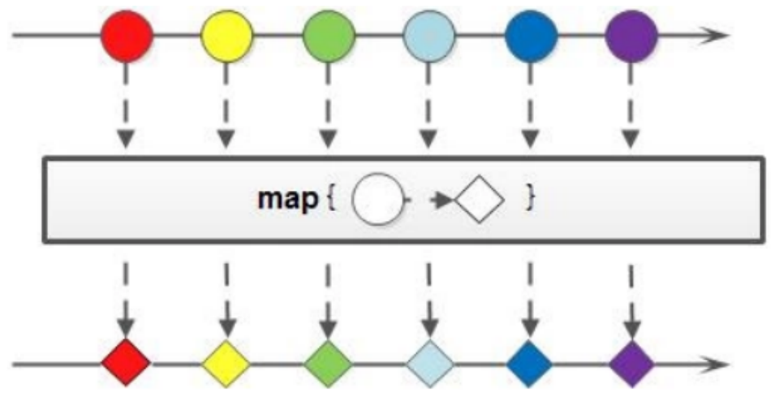


该接口需要一个Function函数式接口参数，可以将当前流中的T类型数据转换为另一种R类型的数据

```java
public class StreamTest11Map {
    public static void main(String[] args) {
         Stream.of("1", "2", "3","4","5","6","7")
                 //.map(msg->Integer.parseInt(msg))
                 .map(Integer::parseInt)
                 .forEach(System.out::println);

    }
}

```

### sorted 排序

==将元素按照比较器进行排序(如果不写 则按照默认的规则进行排序)==

```java
Stream<T> sorted(Comparator<? super T> comparator);
```


在使用的时候可以根据自然规则排序，也可以通过比较强来指定对应的排序规则

```java
public class StreamTest12Sorted {
    public static void main(String[] args) {
         Stream.of("1", "3", "2","4","0","9","7")
                 //.map(msg->Integer.parseInt(msg))
                 .map(Integer::parseInt)
                 //.sorted() // 根据数据的自然顺序排序
                 .sorted((o1,o2)->o2-o1) // 根据比较强指定排序规则
                 .forEach(System.out::println);
    }
}
```

### distinct 去重

```Java
Stream<T> distinct();
```

 Stream流中的distinct方法对于基本数据类型是可以直接出重的，但是对于自定义类型，我们是需要重写hashCode和equals方法来移除重复元素。


```Java
public class StreamTest13Distinct {
    public static void main(String[] args) {
        Stream.of("1", "3", "3","4","0","1","7")
                //.map(msg->Integer.parseInt(msg))
                .map(Integer::parseInt)
                //.sorted() // 根据数据的自然顺序排序
                .sorted((o1,o2)->o2-o1) // 根据比较强指定排序规则
                .distinct() // 去掉重复的记录
                .forEach(System.out::println);
        System.out.println("--------");
        Stream.of(
                        new Person("张三",18)
                        ,new Person("李四",22)
                        ,new Person("张三",18)
                ).distinct()
                .forEach(System.out::println);

    }
}
```


### match 判断是否满足条件 (终结方法)

```Java
boolean anyMatch(Predicate<? super T> predicate); // 元素是否有任意一个满足条件
boolean allMatch(Predicate<? super T> predicate); // 元素是否都满足条件
boolean noneMatch(Predicate<? super T> predicate); // 元素是否都不满足条件
```

